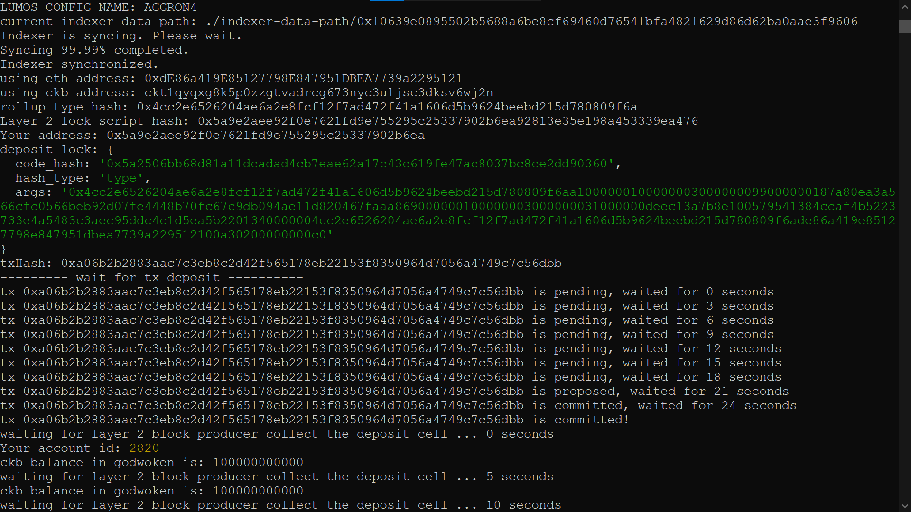
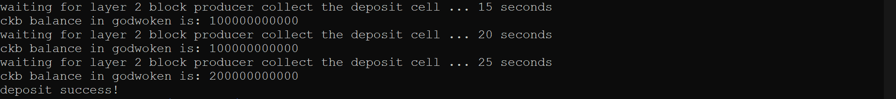

# Gitcoin: 1) Create a Godwoken Account on the EVM Layer 2 Testnet

### 1. Create and Fund an Account with CKBytes on Layer 1

#### List account

#### L1 deposit on block explorer
[Block explorer link](https://explorer.nervos.org/aggron/address/ckt1qyqxg8k5p0zzgtvadrcg673nyc3uljsc3dksv6wj2n)

### 2. Deposit some CKBytes on Layer 2

