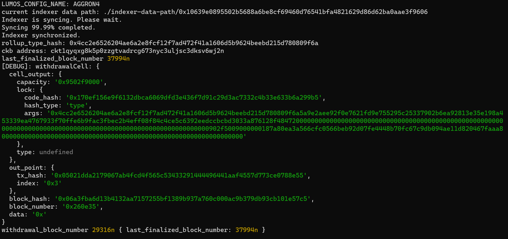
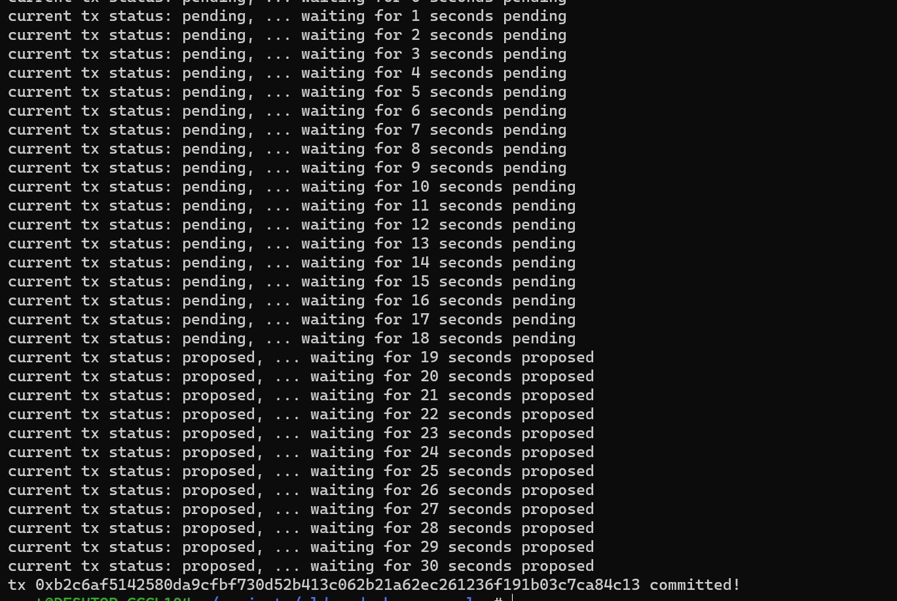

# Gitcoin: 10) Complete Withdrawal Process By Unlocking The Funds

## 1. A screenshot of the console output immediately after running the "unlock" command.

## 2. The Ethereum address that you've used for your Layer 2 account (in text format).

   <b>0xde86a419e85127798e847951dbea7739a2295121</b>   

## 3. The Nervos Layer 1 address that you passed to withdraw command (in text format).

  <b>ckt1qyqxg8k5p0zzgtvadrcg673nyc3uljsc3dksv6wj2n</b>   
