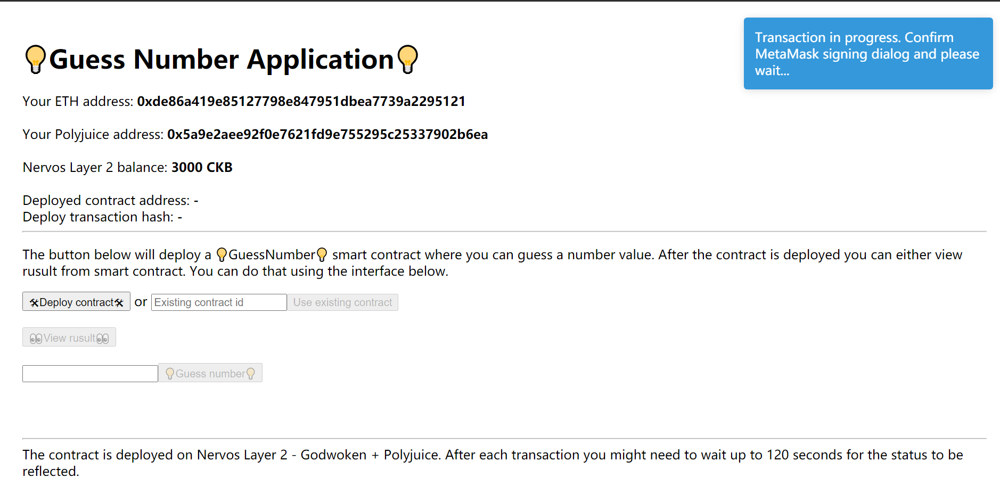

# Document Porting An  Ethereum DApp To Polyjuice
## Introduction

Polyjuice is a layer 2 solution that provides a Web3 compatible interface on top of Nervos CKB.

Learning Polyjuice will allow you to easily create decentralized web3 applications in Node that are capable of running on top of the CKB blockchain. You can take advantage of NervOS libraries like Polyjuice, Capsule and Lumos to extend features of new and existing dApps as well as create smart contract scripts in Rust.

### 1. Setup the Godwoken Testnet Network in MetaMask

Your MetaMask wallet will need to be configured to communicate with the Godwoken Layer 2 network. To do this, you will need to configure a new custom RPC. From the network selection dropdown, select "Custom RPC".


From there you will be presented with a form to specify the network settings.


Enter the following details.

```
Network Name: Godwoken Testnet
RPC URL: https://godwoken-testnet-web3-rpc.ckbapp.dev
Chain ID: 71393
Currency Symbol: <Leave Empty>
Block Explorer URL: <Leave Empty>
```


### 2. Setting up your contract.

download the Dapp：
https://github.com/lianghowe/nervos/tree/main/liang/task7/GuessGame

    yarn
    yarn build
    yarn start:ganache

Then

    yarn ui

Click http://localhost:3000 , See what happened.

### 3. Install Polyjuice Dependencies
Begin porting this Ethereum application to use Nervos' Layer 2. Go to install the required dependencies for working with Godwoken and Polyjuice.

```
yarn add @polyjuice-provider/web3@0.0.1-rc6 nervos-godwoken-integration@0.0.6
```

```@polyjuice-provider/web3``` is a custom Polyjuice web3 provider. It is required for interaction with Nervos' Layer 2 smart contracts.

```nervos-godwoken-integration``` is a tool that can generate Polyjuice address based on your Ethereum address. You might be required to use Polyjuice address if you store values mapped to addresses in your contracts.

### 4. Configure the Web3 Provider for the Polyjuice Web3 Provider

Here is the contents of the file ```src/config.ts``` that we just created:

```
export const CONFIG = {
    WEB3_PROVIDER_URL: 'https://godwoken-testnet-web3-rpc.ckbapp.dev',
    ROLLUP_TYPE_HASH: '0x4cc2e6526204ae6a2e8fcf12f7ad472f41a1606d5b9624beebd215d780809f6a',
    ETH_ACCOUNT_LOCK_CODE_HASH: '0xdeec13a7b8e100579541384ccaf4b5223733e4a5483c3aec95ddc4c1d5ea5b22'
};
```

At, first you need to import a few dependencies. You will need update the main UI in the file ```src/ui/app.tsx```

Go on.

```
import { PolyjuiceHttpProvider } from '@polyjuice-provider/web3';
import { CONFIG } from '../config';
```


### 5. Display Polyjuice Address in Your Application

Every Ethereum address can be translated into a Polyjuice address on Nervos' Layer 2. This can be done using the AddressTranslator class.

```
import { AddressTranslator } from 'nervos-godwoken-integration';
```
 Add PolyjuiceHttpProvider to our DApp to utilize it for our web3 instance instead of web3.js.
```
const godwokenRpcUrl = CONFIG.WEB3_PROVIDER_URL;
const providerConfig = {
rollupTypeHash: CONFIG.ROLLUP_TYPE_HASH,
ethAccountLockCodeHash: CONFIG.ETH_ACCOUNT_LOCK_CODE_HASH,
web3Url: godwokenRpcUrl
};
const provider = new PolyjuiceHttpProvider(godwokenRpcUrl, providerConfig);
const web3 = new Web3(provider);

```


### 6. Completed , View your dapp and start ui.

Run 
    
    yarn ui 
    
Go to ```http://localhost:3000```
Change your MetaMask network to Godwoken Testnet, which we setup earlier in this guide.

Now the application running on the Godwoken Testnet!


