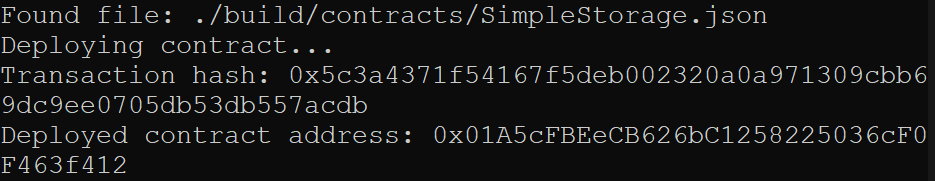

# 2. Deploy a Simple Ethereum Smart Contract on Polyjuice</h2>

## 1. A screenshot of the console output immediately after you have successfully deployed a smart contract.

## 2. The transaction hash from the contract deployment (in text format).

  <b>0x5c3a4371f54167f5deb002320a0a971309cbb67f09dc9ee0705db53db557acdb</b>      
   
## 3. The deployed contract address from the contract deployment (in text format).

<b>0x01A5cFBEeCB626bC1258225036cF0fEDF463f412</b>
