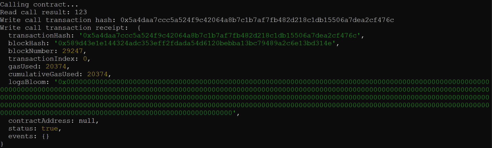

# NervosHackathon_3

## 1. A screenshot of the console output immediately after you have successfully issued a smart contract call.



## 2. The transaction hash from the console output (in text format).

   <b>0x5a4daa7ccc5a524f9c42064a8b7c1b7af7fb482d218c1db15506a7dea2cf476c</b> <br><br>   

## 3. The contract address that you called (in text format).

    <b>0x01A5cFBEeCB626bC1258225036cF0fEDF463f412</b>

## 4. The ABI for contract you made a call on (in text format).

```
[
  {
    "inputs": [],
    "stateMutability": "payable",
    "type": "constructor"
  },
  {
    "inputs": [
      {
        "internalType": "uint256",
        "name": "x",
        "type": "uint256"
      }
    ],
    "name": "set",
    "outputs": [],
    "stateMutability": "payable",
    "type": "function"
  },
  {
    "inputs": [],
    "name": "get",
    "outputs": [
      {
        "internalType": "uint256",
        "name": "",
        "type": "uint256"
      }
    ],
    "stateMutability": "view",
    "type": "function"
  }
]
```
