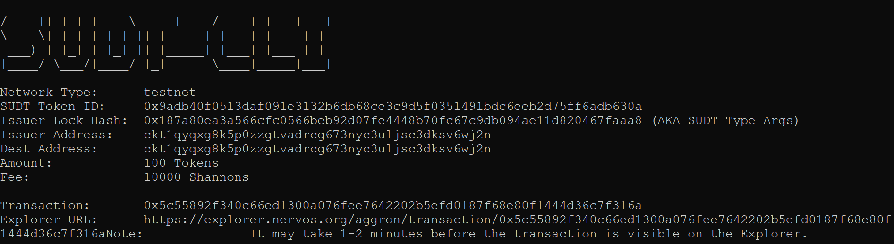
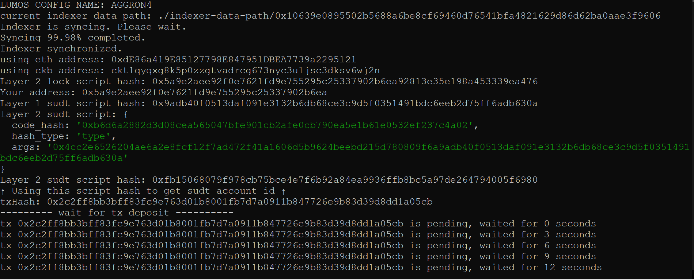

# NervosHackathon_4

## 1. A link to the Layer 1 address you funded on the Testnet Explorer.

https://explorer.nervos.org/aggron/address/ckt1qyqxg8k5p0zzgtvadrcg673nyc3uljsc3dksv6wj2n

## 2. A screenshot of the console output immediately after using sudt-cli to create your SUDT tokens on Layer 1.

## 3. A link to the transaction ID created by sudt-cli on the Testnet Explorer.

https://explorer.nervos.org/aggron/transaction/0x5c55892f340c66ed1300a076fee7642202b5efd0187f68e80f1444d36c7f316a

## 4. A screenshot of the console output immediately after you have successfully submitted a deposit to Layer 2 using the account-cli tool.

## 5. The SUDT ID from the console output after executing the deposit script (in text format).

 <b>2831</b>   
