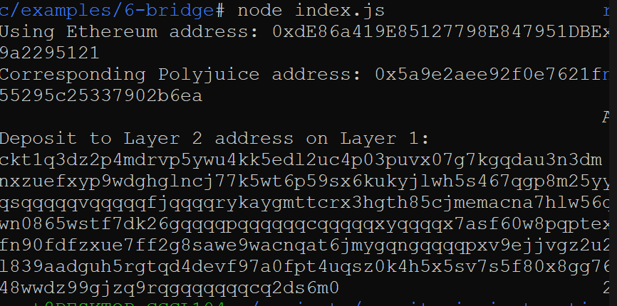

# Gitcoin: 6) Use Force Bridge to Deposit Tokens From Ethereum to Polyjuice

## 1. A screenshot of the console output immediately after you have successfully generated your Deposit Receiver Address.

## 2. Your Deposit Receiver Address (in text format).

  <b>ckt1q3dz2p4mdrvp5ywu4kk5edl2uc4p03puvx07g7kgqdau3n3dmypkqnxzuefxyp9wdghglncj77k5wt6p59sx6kukyjlwh5s467qgp8m25yqqqqqsqqqqqvqqqqqfjqqqqrykaygmttcrx3hgth85cjmemacna7hlw56xw4xwn0865wstf7dk26gqqqqpqqqqqqcqqqqqxyqqqqx7asf60w8pqpte2sfcfn90fdfzxue7ff2g8sawe9wacnqat6jmygqngqqqqpxv9ejjvgz2u63w3l839aadguh5rgtqd4devf97a0fpt4uqsz0k4h5x5sv7s5f80x8gg723m048wwdz99gjzq9rqgqqqqqqcq2ds6m0</b>   

## 3. The Ethereum address used to generate the Deposit Receiver Address (in text format).

  <b>0xdE86a419E85127798E847951DBEA7739a2295121</b>   

## 4. A link to the Etherscan explorer for the successful Force Bridge transaction. This can be found on Force Bridge under History→Succeed.

https://rinkeby.etherscan.io/tx/0x1c93880a9f516a7253b0631a3027d2f7a47495e8f4ca3f2d4742f219efb49f71

## 5 A link to the Nervos explorer for the successful Force bridge transaction. This can be found on Force Bridge under History→Succeed.

https://explorer.nervos.org/aggron/transaction/0xaa2b6f9b825bb1cf1b2e960da0d8de93d7501006212584197d22f1dca33980cd
