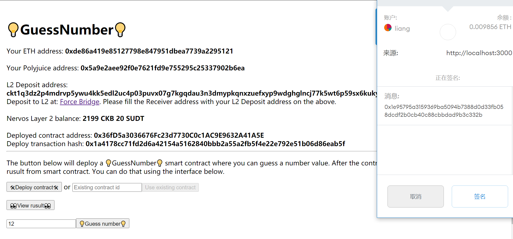

# Gitcoin: 8) Modify the Ported dApp so it Supports Ethereum Assets via Force Bridge

## 1. A screenshot or video of your EVM application on Layer 2 with Force Bridge support.

## 2. The address of the SUDT-ERC20 Proxy Contract that you deployed (in text format).

   <b>0x30024327A701613e8840d604470CcA570f474e99</b>   

## 3. A link to the GitHub repository with your EVM application that integrates Force Bridge support.

https://github.com/Dex68/nervos_gitcoin/tree/main/task8/GuessGame
